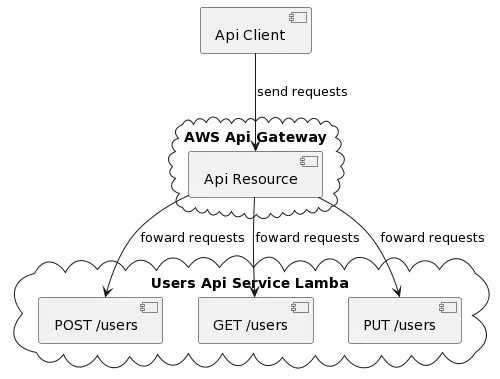

# User service

Provides api endpoints for manipulating data of users.

## Diagram
 

## Design Tradeoff
Due to lacking of time as well as the easy setup for developing the demo:
- i used the in-memory array for holding user data. This is not good for lambda usage because the data will be not consistent when more than one lambda instance are spawned. In real life, a database/data-service should be used instead.  
- only some unit tests and integration tests were added for the demo purpose
- use terraform local backend for easy setup. 

## Requirements
- Go 1.19
- Terraform 1.3.7
- AWS access key and secret key (see https://aws.amazon.com/premiumsupport/knowledge-center/create-access-key)
## Local development
### 1. Start local service
```
> make start
```
### 1. Build
```
> make build
```
### 1. Running Tests
```
> make unit-test
> make integration-test
```

## Cloud Deployment
### Setup
```
> make infra-init
```
### Deploy
```
> make infra-deploy
# The api endpoint is printed as the output after the terraform applies successfully
```
### Destroy
```
> make infra-destroy
```

## Example queries
Please use the api endpoint printed after terraform applies successfully here: 

1. Listing users
```
curl --request GET \
  --url https://ih8509tmd5.execute-api.eu-north-1.amazonaws.com/dev/users \
  --header 'Authorization: secret'
```
1. Add a new user
```
curl --request POST \
  --url https://ih8509tmd5.execute-api.eu-north-1.amazonaws.com/dev/users \
  --header 'Authorization: secret' \
  --header 'Content-Type: application/json' \
  --data '{
	"email": "test@example.com",
	"first_name": "first name",
	"last_name": "last name",
	"address": "real address"
}'
```
1. Update an user
```
curl --request PUT \
  --url https://ih8509tmd5.execute-api.eu-north-1.amazonaws.com/dev/users \
  --header 'Authorization: secret' \
  --header 'Content-Type: application/json' \
  --data '{
	"email": "test@example.com",
	"first_name": "another name",
	"last_name": "last name",
	"address": "real address"
}'
```

